# Data-Analysis-on-CLT-Rocking-Shear-Walls

<em>AMATH 582 Final: Data Analysis on CLT Rocking Shear Walls</em>

<em>Sarah Wichman, Chi-Pu (Tom) Lin, and Nicolette Lewis</em>

<em>March 19, 2020</em>

<h1><em>Abstract</em></h1>

<em>Accelerometer data
from the NHERI TallWood test on a full-scale two-story shake table test on a timber
building was used to study the modal properties of the specimen. Many techniques
in data analysis were utilized including Gaussian filters, averaging filters, Fourier
transforms, spectrograms and SVDs. Using these techniques, investigations into
dynamical information about the specimen that hadn’t previously been explored were
completed.</em>

<h1><em>1
Introduction and Overview</em></h1>

<em>With the
development of engineered wood products such as cross laminated timber (CLT), tall
timber buildings are becoming feasible and offer benefits such as faster construction
and the use of sustainable building materials. It has also opened the door to creating
seismic resilient systems that sustain minor damage during large earthquakes. With
this in mind, the NHERI TallWood Project, funded by the National</em>

<em>Science
Foundation, is developing a rocking CLT wall seismic force resisting system for
tall timber buildings. During the summer of 2017, the NHERI TallWood group tested
a full-scale two-story mass timber building (Fig. 1), with CLT post-tensioned
rocking walls as the lateral system at the NHERI Large High Performance Outdoor
Shake Table at the University of California, San Diego (UCSD). Extensive analysis
of the behavior of this specimen has been conducted to study how the building performed
and the potential for using timber to create a seismically resilient structure.
These previous studies have looked closely at the the overall displacements of the
structure and the movements of each individual component to study how susceptible
it is to damage [4], [1], and [6]. Limited work however has been conducted to study
the modal response of this specimen during the test. This report aims to fill those
gaps and to look at the overall modal response of the structure by leveraging different
data analysis technique (e.g.</em>

<em>Fourier
transform, spectrograms, and singular value decomposition).</em>

<em>The data used
in this report was obtained by Sarah Wichman (co-author of this report) and the
rest of the NHERI TallWood group [3]. All data is publicly available on the NHERI
DesignSafe cyberinfrastructre [5].</em>

<h2><em>1.1
Test Setup</em></h2>

<em>Fig. 1 shows
the structure tested. The test specimen was two stories, each with a floor size of
20 feet x 58 feet. The first floor was 12 feet tall and the second floor was 10
feet tall. The gravity loads were supported by columns, and the lateral loads were
resisted by two coupled rocking shear walls [6], see Fig. 1. The specimen was
constructed on the NHERI shake-table at UCSD and can simulate ground motions in
one direction. The</em>

<em>specimen
was constructed such that the ground motion would move in the direction parallel
to the rocking shear walls. A series of fourteen total earthquake ground motions
were used to test the specimen and in between the ground motions, white noise tests
were completed to obtain the (elastic) natural period of the building. Table 1 summarizes
all the tests and the order in which tests were completed. The tests are numbered
1-14 </em>

<em>&nbsp;</em>

<em>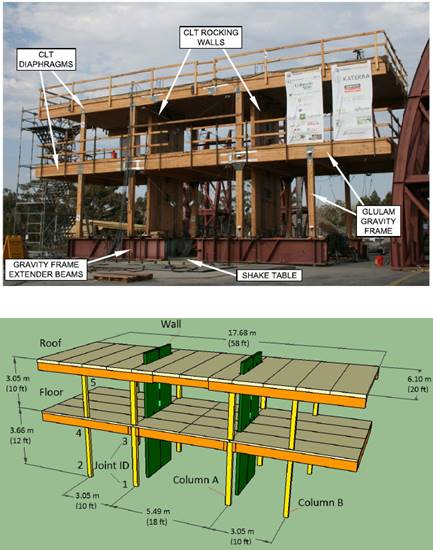</em>

<em>(a) Photo</em>

<em>(b) Design
Configuration</em>

<em>Figure 1:
Test Specimen [6]</em>

<em>&nbsp;</em>

<em>and are labeled
based on the historic earthquake motion that they represent. The motions are also
denoted as service level earthquake (SLE), design based earthquake (DBE), and maximum
considered earthquake (MCE) these are indicators of the size of the earthquake.
MCE are the largest earthquakes and SLE are the smallest earthquakes. More information
about these earthquakes can be found in [6]. The white noise tests are denoted by
WN. Again, they were run before and after every ground motion. Periodically
during testing slight modifications to the structure were made, so white noise tests
were also conducted before and after these modifications which is why two white noise
tests sometimes happened right after each other as seen in the testing schedule.
These modifications will not be discussed or analyses in detail in this report. In
total there were 21 white noise tests.</em>

 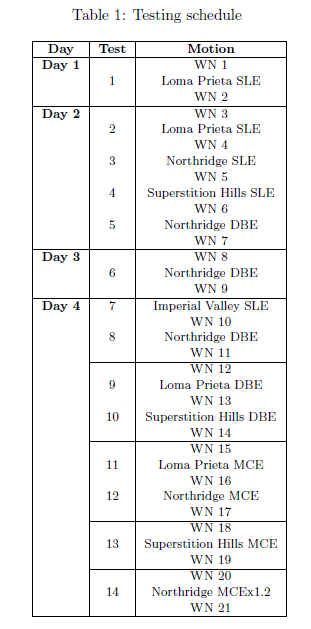

<em>&nbsp;</em>

<em>A total
of 357 instruments were used on the structure for data collection. In this report
only 24 of the acceleration sensors were used for the data processing. The sensors
used were all 4000A Silicon Mems accelerometers with a full range of 10G from measurement
specialties and had an accuracy of 5%. Ten of the accelerometers used were located
on the roof of the structure and another 10 were located on the first floor. Fig.
2 shows an aerial view of the floors with the locations of each accelerometer and
their names labeled. Although the shake table only moved in one direction, at each
location there were accelerometers that measured movement in each of the horizontal
directions to capture any potential torsional effects in the building. The final four
accelerometers that were used for this report were located at the base of each
of the four shear walls and measured acceleration in the direction parallel to shaking.
These four accelerometers were assumed to measure the movement of the shake table
itself.</em>

<em></em>

<em>&nbsp;</em>

<em>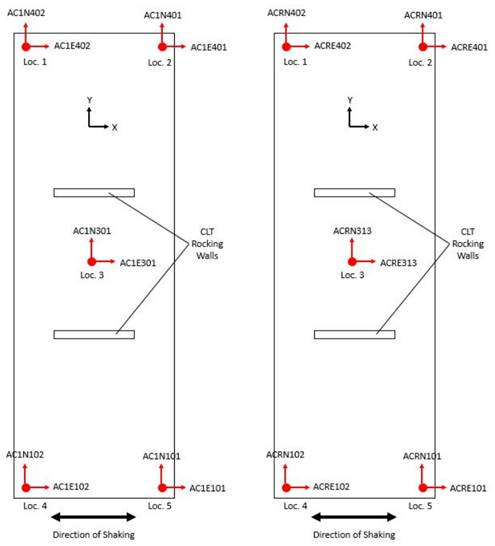</em>

<em>(a) First
Floor (b) Roof</em>

<em>Figure 2:
Aerial View of Accelerometer Locations and Names</em>

<em>&nbsp;</em>

<h2><em>1.2
Project Scope</em></h2>

<em>Due to the
size of the test from which this data was collected, there was a lot of noise that
appeared in the data. In order to begin data processing, all the acceleration data
was first filtered using Gaussian filters in order to get more clear results. Both
a high-pass and a low-pass filter were applied to the data. This processed data was
then used for all the analyses discussed in this report. As mentioned previously,
White noise ground motions were used to excite the structure in order to capture
the natural frequencies of the structure after each test/modification. The data obtained
from the accelerometers were analyzed using Fourier transform to compute the dominate
frequencies. The data was</em>

<em>filtered
through (1) Gaussian filter on the spectral content, and (2) averaging the spectral
content from all the pertinent sensors. The natural frequencies of the first and
second mode were computed. Moreover, the change in the frequencies due to the different
tests/modifications was also explored. Spectrograms were computed from accelerometer
data from the structure excited by earthquake ground motions. This allowed the evolution
of the frequency content to be visualized. The spectrogram also allows for comparison
between low frequency and high frequency with respect to time and intensity of ground
shaking. </em>

<em>In addition,
a modal analysis study was conducted on the overall structure to determine the primary
modes of shaking. This was completed using a Single Value Decomposition (SVD) algorithm
on filtered acceleration data in both the direction of shaking and the direction
perpendicular to shaking. The results from the SVD were used to plot the primary
modes of the structure. Finally, a low-rank reconstruction of the data was performed
to determine how the data was affected by only accounting for the primary modes.
The last thing investigated with this data was an analysis of the interstory response.
Data was taken in the principle ground motion direction (x-direction, shown in Fig.
2) from all accelerometers on each story, and average time histories for each floor
were extracted. An SVD of these time histories was completed, and a Fast-Fourier
Transform of the primary mode revealed the fundamental frequency of vibration of
each</em>

<em>single-degree
of freedom representation of the structure’s floors. An observation matrix containing
all story accelerations for each test in the x-direction was also investigated.</em>

<h1><em>2
Theoretical Background</em></h1>

<h2><em>Fast-Fourier
Transform</em></h2>

<em>Fourier introduced
the concept of representing a given function f(x) by a trigonometric series of sines
and cosines:</em>

<em>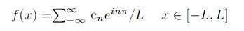</em>

<em>Based on
this idea, the Fast Fourier Transform (FFT) was created, which transforms a signal
from its original domain to a frequency domain. The Fourier Transform is an integral
transform defined over the entire line x </em><em>∈</em><em> [-∞, ∞]. The Fourier transform and its inverse are defined
as</em>

<em>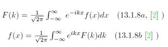</em>

<em>The key
features of the FFT routine are as follows:</em>

<em>• It has
a low operation count: O(NlogN).</em>

<em>• It finds
the transform on an interval x </em><em>∈</em><em> [−L, L]. Since
the integration kernel is  oscillatory, it implies that the solutions on this finite
interval have periodic boundary conditions.</em>

<em>• The key
to lowering the operation count to O(N logN) is in discretizing the range x </em><em>∈</em><em> [−L, L] into 2n points, i.e. the number of points should
be [2, 4, 8, 16, 32, 64, 128, 256, ...].</em>

<em>• The FFT
has excellent accuracy properties, typically well beyond that of standard discretization
schemes This type of transform can be used for many things in the field of digital
signal processing and imaging because the transform can organize data by frequency
and it can be easier to find strong frequencies and easier to identify frequencies
that may just be noise.</em>

<h2><em>Gabor
Tranform/SFFT</em></h2>

<em>We can easily
obtain a Fourier transform of a set of points and resolve the frequency content
of such a set; However, signals over time or space contain sets of points for each
instance of the domain, and as a result, will lose the spatial or temporal resolution
of frequency magnitude peaks within the signal once a Fourier transform is performed.
This is due to the integration over the spatial or temporal domain which must be
completed in order to resolve the magnitude of the frequencies of the signal throughout
the domain.</em>

<em>If the entire
signal is sampled when a Fourier transform is completed, the frequency content of
the signal’s entire domain is represented in the Fourier transform.</em>

<em>One way
to temporally localize peaks in the frequency of a signal is to utilize a
window upon the temporal domain and perform a Fourier transform solely within the
windowed domain. This way, the frequency content obtained from a spectral
analysis of the window is known to most likely be within the window from which
the frequency content was calculated. Sliding the window over the domain and performing
Fourier transforms</em>

<em>on the
window creates spectral representations of each instance of windowing. These
spectral analysis ‘slices’ can be plotted over time creating spectrograms to
demonstrate the changes in frequency content throughout the signal. </em>

<em>The chosen
method employed here and described above is known as a Gabor Transform, a windowed
version of the Fourier transform which involves replacing the original kernel of
the Fourier transform with one that allows a window to slide over the domain of
the function and isolate local frequency content centered around the window in time.
What is described is a discrete form of the integral,</em>

<em>&nbsp;</em>

<em>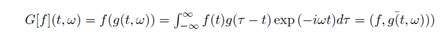</em>

<em>where
the function f(t) represents the signal as it varies with time and g(τ − t)
represents the Gabor Window</em>

<em>which
is utilized to filter the signal temporally. This can be represented in the
following form, as found in [2].</em>

<em>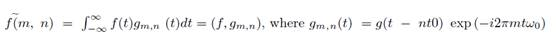</em>

<h2><em>Singular
Value Decomposition</em></h2>

<em>The Singular
Value Decomposition, or SVD, is an incredibly powerful tool in linear algebra which
can be used to examine the principle dynamics of data. The technique uses an expansion
of the data into two bases to represent said data in diagonalized form, with principle
components and energies recorded to allow for reconstruction of the data in a lower
rank. According to Kutz, in Data Driven Modelling and Scientific Computing [2] ,
for any set of data A[m</em><em>∗</em><em>n], the SVD
makes diagonalization possible if the proper</em>

<em>bases for
the domain and range are used. Consider that since U and V are orthonormal bases
in C[m</em><em>∗</em><em>m] and C[n</em><em>∗</em><em>n] respectively, then any vector in these spaces can be
expanded in their bases. In short, what this means is that any matrix can be diagonalized
with the SVD, as the method is not contingent on positive definiteness or symmetry
of the matrix. The SVD of a matrix is guaranteed to exist; but the SVD does not
necessarily guarantee that all dynamics within the system will be captured. Careful
inspection of the</em>

<em>modal decomposition
of the data and energies associated with the proper orthogonal modes sheds light
on the primary dynamics and hidden dynamic behavior. The multiple bases utilized
in the SVD allow for decomposition of a symmetrized form of the data matrix, A.</em>

<em>The SVD
can be performed with the following matrix operations,</em>

<em>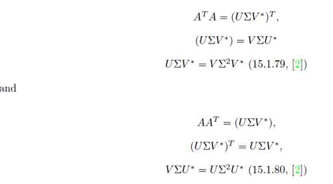</em>

<em>Post multiplication
of the above results with V and U respectively provides self-consistent Eigenvalue
problems,</em>

<em>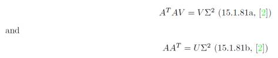</em>

<em>&nbsp;</em>

<em>The above
represents the decomposition of the data into its principle components and singular
values, which can then be used to create low rank approximations of the data. By
examining the singular values and the principle components and contributions of
each principle component to the features of the data analyzed, we can make inferences
about the driving dynamics of the data and interpret the effects of interactions</em>

<em>between components
of the data.</em>

<h1><em>3
Algorithm Implementation and Development</em></h1>

<h2><em>3.1
Filtering</em></h2>

<em>Due to the
large scale nature of this test, the data collected was very noisy, so before doing
any analysis on the data, it was filtered. To determine which frequencies should
be filtered out, an FFT was performed to find the frequency content of the signal.
Using the results of the FFT, a Gaussian filter was chosen to filter out very high
frequency data:</em>

<em>&nbsp;</em>

<em>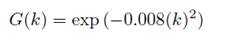</em><em> (1)</em>

<em>&nbsp;</em>

<em>After looking
more closely at the data, it was determined that there was also some very low frequency
content that needed to be filtered out. In order to filter out this low frequency
data, an inverted Gaussian filter was chosen:</em>

<em>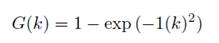</em><em> (2)</em>

<em>The data
that resulted from using both these filters is what was used for all the analyses
presented in this report. The same Gaussian filters were used for all accelerometer
sensors on the structure.</em>

<em>&nbsp;</em>

<h2><em>3.2
White Noise</em></h2>

<em>To obtain
the natural frequencies from the white noise test, the accelerometer data (in the
primary direction of shaking) from all 21 white noise tests were loaded into Matlab.
Two for-loops were used, one to loop through each test (outer loop), and another
to loop through each sensor (inner loop). Within the inner loop, FFT was computed
on the filtered acceleration data. Then, the average of the filtered FFT data from
the sensors are computed. The max value is identified with the max(abs()) function
and the associated</em>

<em>frequency
is extracted. Note that the dominant frequency was extracted from the averaged data,
and for each individual sensor as well. Next, the outer loop will repeat these steps
for each test run. In order to obtain the second natural frequency, the algorithm
is repeated with a single Gaussian filter:</em>

<em>&nbsp;</em>

<em>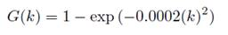</em><em> (3)</em>

<em>&nbsp;</em>

<em>This is
to prevent filtering out the second mode.</em>

<em>In summary,
three data analysis tools were employed for this section: (1) Gaussian filter, (2)
averaging filter, and (3) Fourier transform.</em>

<em>&nbsp;</em>

<h2><em>3.3
Spectrogram of Ground Motion Response</em></h2>

<em>The algorithm
for computing the spectrogram of the structure from the ground motion starts like
the algorithm for the white noise. For the spectrogram, it is possible for
higher mode effects to be removed using the Gaussian filter, thus only an inverse
Gaussian filter was used:</em>

<em>&nbsp;</em>

<em>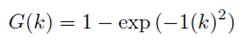</em><em> (4)</em>

<em>&nbsp;</em>

<em>Note that
the spectrogram was computed on data from a single sensor (center location on the
roof) from test 14 (earthquake ground motion).</em>

<em>In order to
obtain the spectrogram, the Gaussian filter with a window size, and step size was
selected (1 and 301, respectively). Then, the algorithm loops through each slice
of time and filters the signal. Next, FFT was computed on the time filtered signal
and saved into a matrix that contains all the frequency content for each time slice.
Lastly, said matrix is plotted with time as the x-axis, and frequency as the y-axis.</em>

<h2><em>3.4
Modal Analysis of Structure</em></h2>

<em>Using
the filtered acceleration data from test 14, an SVD was performed to extract the
mode shapes. For this analysis the 20 accelerometers seen in Fig. 2 were all
used. As row vectors, the data from each accelerometer was appended in one large
matrix, and the SVD was taken of this matrix (using the built in SVD function in
MATLAB). Careful consideration was taken when assembling this matrix and the order
in which the accelerometer data was stacked in the matrix was noted. The order in
which the matrix was assembled was as follows:</em>

<em>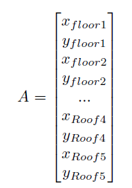</em>

<em>where x
floor1 is the filtered acceleration data in the x direction, on the floor, in location
1. Taking the SVD of matrix A diagonalized the matrix and gives the lowest rank
possible. Computing the SVD of the matrix A results in three new matrices: U ,
Σ, and V . The matrix U has all the modes in column vectors, in order of highest
mode to lowest mode. The matrix Σ shows how much variance is in each mode for each
data point</em>

<em>included.
The matrix V is a representation of how much each data group is projected onto each
mode.</em>

<em>The amount
of energy from each mode was calculated using the Σ matrix. The diagonal of the
Σ matrix was divided by the sum of the diagonal to get the values in terms of percentage.
To determine what each mode looked like, the U matrix was used. This U matrix shows
for each mode, where the location of each data group would be. In order to
visualize these modes better, the location of each accelerometer was plotted on
a 3D plot. Then, for each mode, the mode shape value for each accelerometer
location from the U matrix was added to the original location. During this process,
the data from the U matrix that corresponded to the x direction accelerometer resulted
in movement in the x direction for that mode shape and same for the y direction.
In order to make the mode shapes more visible when plotting, a scale factor of 10
was applied to the displacements.</em>

<em>A low rank
reconstruction study was also performed on the data to determine how reconstructing
the data to include only the first few major modes would affect the accuracy of the
data. This was done by trimming the matrices U , Σ, and V to only include the first
few modes and then multiplying them together with U ΣV</em><em>∗</em><em> to get the reconstructed low rank approximation of the
data.</em>

<h2><em>3.5
Interstory Response</em></h2>

<em>Average
time history of story accelerations for Test 14 were extracted from summing
over several realizations of filtered accelerometer data from each floor. A Proper
Orthogonal Decomposition (POD) of the modes of the average accelerations per floor
was examined, and an interpretation of the U, Σ, and V components</em>

<em>output from
the SVD was made. The most powerful spectral content of the average story acceleration
time histories was then investigated, and a correlative relationship between system
dynamics and fundamental frequency of POD modes is proposed.</em>

<em>Interstory
response was investigated by examining the time history difference between accelerations
at the base of the wall and the first story, and the difference between accelerations
at the first story and those of the roof in the x-direction (primary direction of
excitation). Nominal acceleration time history per story was determined by averaging
over the time-synchronized accelerometer data of the groups of sensors on</em>

<em>each level,
effectively smoothing out some of the high frequency noise within the signal. A SVD
was then completed on a set containing the average acceleration time history for
each level of the structure. The primary modes of this SVD represent the largest
variations in oscillatory behavior between stories over time. A Fourier Transform
was then performed on the most powerful SVD modes representing interstory acceleration
variance, and the most energy dense frequency of the spectral content was determined.</em>

<em>In short,
the algorithm can be described as follows:</em>

<em>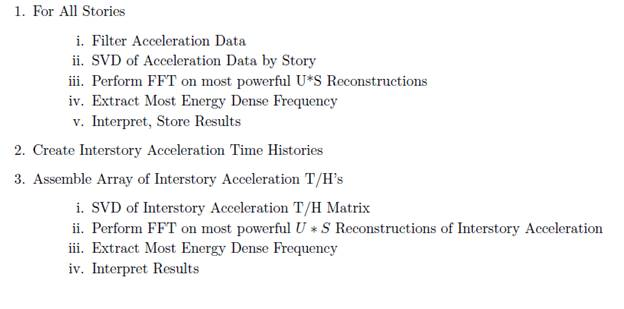</em>

<em>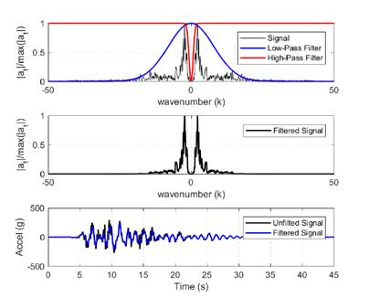</em>

<h1><em>4
Computational Results</em></h1>

<h2><em>4.1
Filtering</em></h2>

<em>Fig. 3 shows
an example of the filtering procedure used for all the acceleration sensors. This
figure shows an example of just one acceleration sensor, but the same process was
used for all sensors. The top figure shows the frequency domain of the signal with
the two Gaussian filters applied to remove the very high frequency content and the
very low frequency content. The middle figure shows the post-processed frequency
content,</em>

<em>and the bottom
figure shows a comparison of the unfiltered data with the filtered data. From this
bottom figure it is clear that the signal is much clearer but still retains the general
behavior. Figure 3: Example of filtering procedure used. (Top) Signal in the frequency
domain along with the two Gaussian filters used. (Middle) The post-filtered signal
field in the frequency domain. (Bottom) The time domain reconstruction of the filtered
signal field compared to the original, un-filtered signal.</em>

<h2><em>&nbsp;</em></h2>

<h2><em>4.2
White Noise</em></h2>

<em>Figure 4
shows the first natural period obtain from each sensor for tests 1, 2, 3, 7, 8, 9,
16, 20, and 21 (black circles). The blue line indicates the average of the black
circles, and the red line is the first natural period using the average filter method
(see Section 3.2). The agreement of the black circles for each tests indicates the
Gaussian filter did a good job at cleaning up the noise. However, the discrepancy
between the blue and</em>

<em>red line,
e.g. see Fig. 4 tests 3, shows that filtering via averaging reduced the noise further
(noise that the Gaussian filter did not remove). Test 9 shows good agreement between
the blue and red line, indicating the Gaussian filter removed most of the noise and
the averaging filter did not contribute much. By plotting the natural period from
the individual sensors, the discrepancies from the sensors can also be identified.
Lastly, the different tests yielded different natural periods. This is as expected
because the white noise ground motion tests are performed between earthquake
ground motion tests (and modifications) that may lead to damage or reparation of
the structure, respectively. This can also be seen clearer in Fig. 5. The natural
period of the first and second modes are shown (top and bottom, respectively). The
natural period of the first mode increases from tests 1 to 3. This is expected as
test 2 was conducted after the first earthquake ground motion that likely loosen
the structural connections (softening the system). Similarly,
  </em>

<em>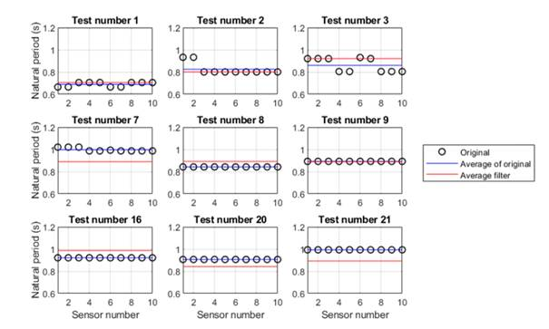</em>

<em>Figure 4:
First natural period</em>

<em>&nbsp;</em>

<em>test 3 had
an increase because the structure experienced yielding which further softened the
system. The decrease in the natural period of the first mode can be contributed to
reparations made to the structure. From Fig. 5, there is not much variation in the
natural period of the second mode. As expected, the natural period are lower for
the second mode (higher frequencies). The consistency of the natural period of the
second mode suggests that the higher modes are not sensitive to the structural damages
incurred during earthquake ground motions.</em>

<em></em>

<em>&nbsp;</em>

<em>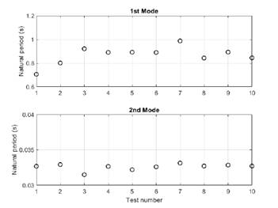</em>

<em>Figure 5:
Evolution of first natural frequency</em>

<h2><em>&nbsp;</em></h2>

<h2><em>4.3
Spectrogram of Ground Motion Response</em></h2>

<em>Figure 6
is a spectrogram of the acceleration from the center sensor on the roof from earthquake
ground motion 14. Note that only data from this sensor from this ground motion was
provided for the sake of brevity, but similar findings can be seen from the other
data. From the spectrogram, the signal noise is negligeable compared to the accelerations
due to the ground motion, as expected. This can be seen by the lack of color before
the 5 second mark and after the 30 second mark. The spectrogram illustrates the
dominate frequency is approximately 8 rads/s. This is approximately 0.8
seconds, similar to the natural period from Fig. 5 (1st mode, test number 14). This
is promising because</em>

<em>it
showed the structure primary response is similar to the natural period of the first
mode. Furthermore, the higher frequencies shaking was present only during strong
shaking. This can be seen from the spectrogram where high frequencies coincide
with brighter colors in the lower frequencies. The higher band of frequencies (approximately
175 rads/s) is also around the natural period of the second mode (approximately
0.0325 s). The nature of earthquakes is that they occur in a wide range of frequencies
(and often random-like</em>

<em>features).
As a results, the structure will respond with frequencies outside of the
natural frequency. However, the structure acts similar to a filter in which the response
is filter to the frequencies in the neighborhood of the natural frequencies of the
structure.</em>

<em></em>

<em>&nbsp;</em>

<em>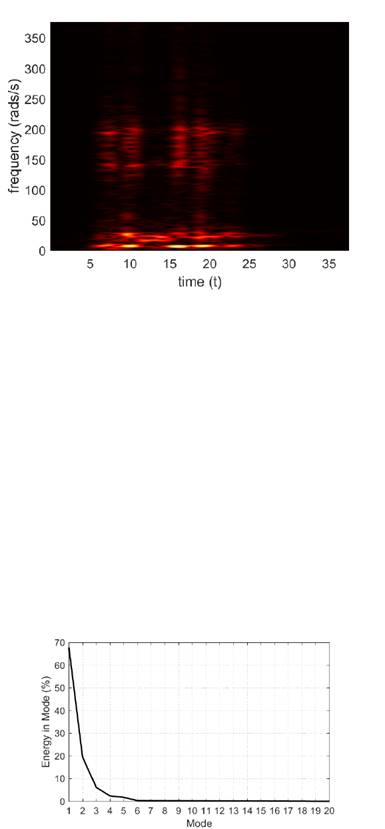</em>

<em>Figure 6:
Spectrogram of acceleration from ground motion 14, center sensor on roof</em>

<h2><em>4.4
Modal Analysis of Structure</em></h2>

<em>The
results from this section are all from the data collected from test 14, the last
and largest ground motion. The same analysis could have been done for any or all
of tests, but only the results from one ground motion are included. Fig. 7 shows
the amount of energy in each mode that resulted from the SVD test on the structure.
The results from this plot show that the first mode is very much the dominate mode,
accounting for almost 70% of the total energy, which is very common for
buildings and very much expected. The second mode accounts for about 20% of the
total energy and after mode 6, the energy contribution is near zero. Fig. 8 shows
the results of the U matrix from the SVD. It should be noted that on the x axis
are the nodes or the accelerometer recordings. Every other recording is the representative
of the acceleration in the direction perpendicular to shaking, which is why
most of them are near zero. We would expect that the first</em>

<em>couple modes
are primarily in the direction of shaking which is what we see for modes 1 and 2.
It should also be noted that the first half of the points are representative of the
accelerations recorded on the floor and the second half are from the roof. In the
first mode, all movement is in the same direction, but for the second mode, the first
floor goes in one direction while the roof goes in the opposite direction. This is
expected behavior in buildings. The third mode doesn’t have a clear pattern
like the first two modes, so this is probably a torsional mode.</em>

<em>&nbsp;</em>

<em>Figure 7:
Energy per mode from the SVD analysis of the structure </em>

<em>&nbsp;</em>

<em>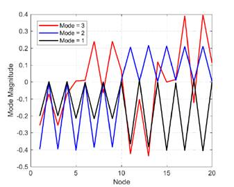</em>

<em>Figure 8:
Modes from the SVD analysis of the structure </em>

<em>To get a
better visual idea of these modes shapes, the mode values from Fig. 8 were applied
to the corresponding locations of the accelerometers and plotted as displacements
in 3D. This visual representation of the mode shapes can be seen in Fig. 9. In these
plots, the grey lines are representative of the original location of the floor and
roof, while the black lines are the mode shapes. The first mode is exactly what we
would expect in a building. Both the floor and roof move in the same direction that
is also in the same direction as the earthquake shaking. The second mode is also
what is expected. The roof has movement in one direction while the floor is moving
in the other. The third mode shape is also what we predicted from Fig. 8: it is
a torsional mode. The fourth mode is very similar to the first mode, but the movement
of the floors is in the direction perpendicular to earthquake shaking. The following
two modes are different types</em>

<em>of
torsional modes. These are all modes that we would expect for building response.
It should be noted that only data from the floor and roof were used (no data from
the wall was used) so these mode shapes are only representative of how the floors
moved, not the walls. Future study can be conducted on the sensor data along the
height of the wall that may lead to findings on higher mode effects that is not torsional
but what is expected for higher modes of cantilever walls.</em>

<em>&nbsp;</em>

<em>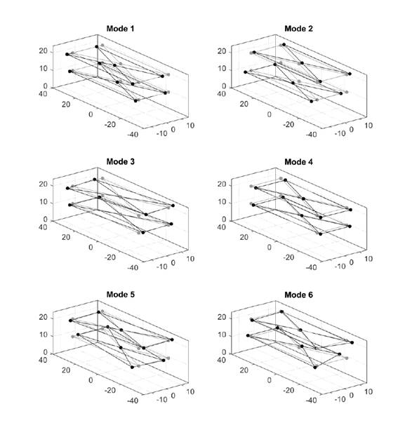</em>

<em>Figure 9:
Mode shapes from the SVD analysis of the structure</em>

<em>15</em>

<em>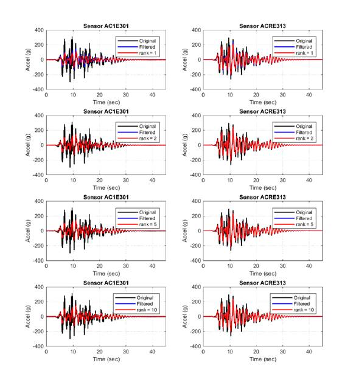</em>

<em>The
final portion of the modal analysis was to complete a low-rank reconstruction. From
Fig. 7 it is clear that anything greater than the second mode doesn’t contribute
much to the overall behavior. The low-rank reconstruction for two acceleration sensors
are show in Fig. 10. This figure shows a rank reconstruction of rank 1, 2, 5, and
10. The rank 2 reconstruction does a very good job at capturing the overall behavior.
Because of this, we can conclude that there were very small torsional effects during
the shaking of the structure, almost all of the movement was just from first and
second mode effects. Figure 10: Low-Rank reconstruction of the accelerometers from
the SVD of the structure</em>

<em>&nbsp;</em>

<em>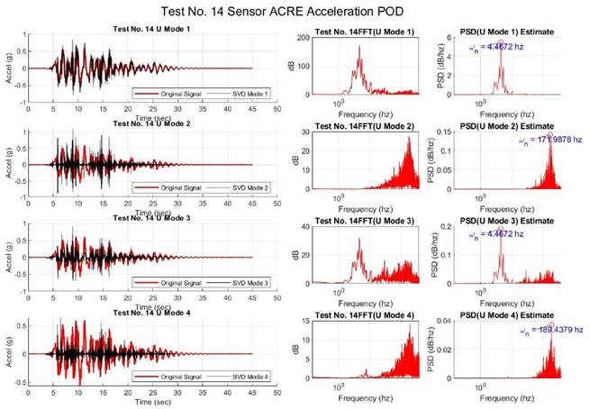</em>

<em>4.5 Story/Interstory
Response</em>

<em>The first
four modes from the SVD of the single degree of freedom accelerometer data seen
in the left-most columns of Fig. 11 and Fig. 13. As can be seen in Fig. 11 in the
leftmost column, the average acceleration data (shown in red, underneath the most
powerful reconstructed mode) lacks high degrees of noise, and the frequency content
of the data indicates that there is a predominant frequency which contains most
of the signal’s energy. Other modes of the POD represent the dominant variations
from the averaged signal that each measurement is somewhat likely to be partially
comprised of. SVD modal participation is contained within V , however, the modal
participations of an SDOF vibration is not of interest in this case. From the PSD
plot on the right-hand side of the figure one can note the dominant power density
of the primary frequency of pointwise vibration in the first POD mode, while the
frequency content and power spectra content of the other modes is saturated and
no dominant frequency is discernible. This indicates high congruence of the acceleration
data measured from each of the sensors within the floor in the inspected direction,
with little time variance and negligible amplitude/power difference. In order for
frequency content of a single degree of freedom to be resolved, a Fourier Transform
was performed on the time history content of the primary modes of the SVD. The results
of the Fourier Transform and Power Spectral Density Estimates of the SVD modes can
be seen in the centre and righthand columns of Figs. 11 through 13.</em>

<em>Figure 11:
SVD and FFT(U) of Roof Accelerations. The observation matrix for the SVD of the
acceleration time history each floor contained all x-direction accelerometers for
Test No. 14. Output and the SVD modes are comprised of variations between sensor
</em>

<em>&nbsp;</em>

<em>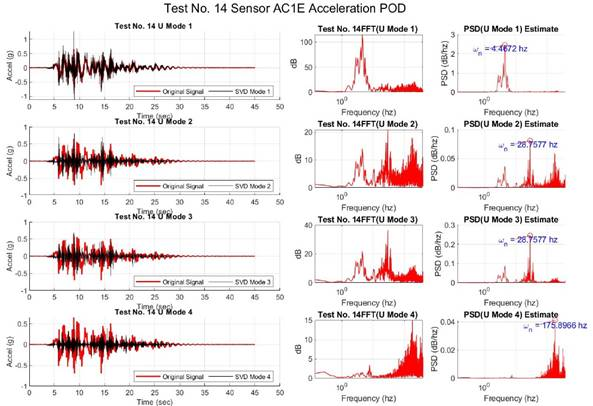</em>

<em>acceleration
magnitude measurements, key features of higher energy vibrations and shocks,
and predominant excitation of modes of lower energy vibration. The most powerful
mode of each SVD is evidently the transient and homogeneous vibrational
response of the story to the ground motion excitation. Most of the vibrational energy
of the system is captured by the first mode of the SVD (power scaling from the S
 components of the SVD is represented by the projection of U into the (g) domain
via U </em><em>∗</em><em> S). The second, third
and fourth modes represent the predominant variations of signal intensity and phase
from the average predominant behavior of the data set, as well as noise that is
common to all signals. Looking closely at the first and third modes of the SVD in
Fig. 12, there is a clear difference in the frequency concentration. The first mode
is the predominant motion of the ground acceleration. The second most powerful can
be interpreted as the contribution to overall acceleration the from action of the
floors in</em>

<em>tandem,
synchronized aside from a slight change in phase. The third mode of the SVD can
be interpreted as the effect of a secondary dynamical state, whether it be the second
or third lowest energy mode of structural response vibration or a compound effect
of several participating vibrational modes.</em>

<em>Figure 12:
SVD and FFT(U) of 1st Story Accelerations.</em>

<em>&nbsp;</em>

<em>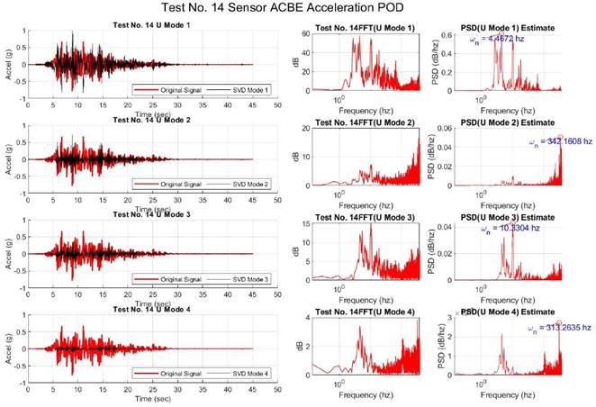</em>

<em>Figure 13:
SVD and FFT(U) of 1st Story Accelerations.</em>

<em>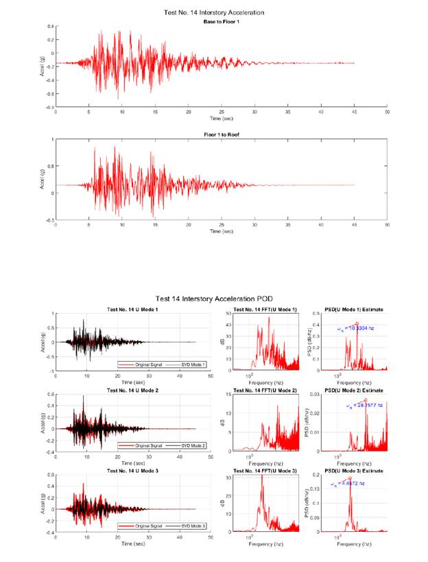</em>

<em>Figure 14:
Interstory Accelerations.</em>

<em>Figure 15:
SVD and FFT(U) of Interstory Accelerations.</em>

<em>Fig. 14
shows the interstory accelerations extracted from the averaged story acceleration
time histories. The interstory relative accelerations between Floor 1 and the Roof
are nearly two times those of the relative accelerations between the base of the
structure and the first floor. This is likely due to combinations of first and second
vibrational mode effects, their superpositions of modal vibration and shapes acting
in constructive</em>

<em>interference
beats to generate larger amplitude accelerations within the second story portion
of the shear walls.</em>

<em>A singular
value decomposition of the averaged story acceleration time histories (base, 1st
floor, and roof) was completed and a Fourier analysis was completed on the strongest
power orthogonal modes of the decomposition. The results of this analysis can be
seen in Fig. 15. The spectral analysis represents the fundamental frequency of the
time history of variations in structural response acceleration between measurements
at varying points along the structure’s height due to random base excitation in
the primary direction of resistance. The frequency of the ground motion was found
to be roughly 4.46 hertz, and the natural frequency of the first most powerful resonance
mode obtained from the singular value decomposition of the acceleration data
from sensors in the ground excitation direction along various heights of the
structure was 10.33hz, giving the structure a measured first natural period, T nSV
D1, of 0.6082 seconds. The natural</em>

<em>frequency
of the second mode of the structure appears to be 28.757 hz with measured second
natural period, TnSV D2, of 0.2185 seconds.</em>

<em>This is incongruent
with previously found values for the resonant frequency, which were obtained via
pointwise investigation of the Fourier transform of the acceleration data of the
individual sensors. What likely is happening with the SDOF extraction is a biasing
of the Fourier domain toward the predominant ground motion acceleration frequency,
as the acceleration data was not normalized by the ground motion acceleration
and thus that ground motion frequency participated in the Fourier Transform. This
would have an effect of lengthening the estimated period of vibration, which is in
agreement with the postulation of ground motion acceleration biasing SDOF FFT output
to lower frequencies, as the spectral content of the modes of the SVD of the interstory
accelerations is of higher frequencies than that of the SDOF analysis. Since
the ground motions are included in the SVD of the overall interstory
acceleration data, they are easily extracted by the SVD as they are the most powerful
contribution to acceleration, and the remaining most powerful modes of the SVD to
be examined are either noise or dynamical response modes which can be isolated and
analyzed for their frequency content, which possibly provides the overall structural
dynamical response natural frequencies of the system.</em>

<h1><em>5
Summary and Conclusions</em></h1>

<em>Data from
two-story timber building shake table test were analyzed to investigate the dynamical
properties and the ground motion response of the structure. The accelerometer data
was filtered using a Gaussian and inverted Gaussian filter in order to remove high
frequency and low frequency noise.</em>

<em>The data
from the white noise test gave the natural period of the first and second mode (0.9
seconds and 0.0325 seconds, respectively). In addition, it showed the change in
the natural period of the first mode between each ground motion testing and modification.
The natural period of the second mode appeared to be less sensitive to the damage
and modifications on the structure. From the consistency in the natural period from
the individual sensor results, it can be seen that the Gaussian filter performed
well. However,</em>

<em>future study
can further examine this by removing the filter and looking at the natural period
from the individual sensor results (if the results remain unchanged, then that indicates
the noise did not affect the results of the natural period). Furthermore, the discrepancy
between the individual sensor results of the natural frequency and the natural frequency
from the average filter method suggests that the average filter further reduced noise
in the data. Spectrogram were computed and showed that the dominate frequencies
are in the neighborhood of the natural period of the first mode. In addition, the
frequencies from the higher modes were only present during intense shaking (and
were also in the neighborhood of the natural period of the second mode). From this,
it can be seen that the structure acted as a vibration filter which took the wide
range of frequencies</em>

<em>from the
earthquake motion and responded with two frequency bands. The third and higher modes
were not immediately visible from the spectrogram. Future study can compare the
frequency content of the earthquake and compare it the frequency content of the
structure’s response. Modal analysis was done using SVD. Singular value decomposition
was done on the sensors from test 14 and showed the energy of each mode (70% and
20% for mode 1 and 2, respectively). The SVD also revealed that negligle energy
was contributed by modes higher than 6. The SVD also allowed the visualization of
the mode shapes of the building, which were as expected from studies in earthquake
engineering. Low rank reconstruction was done and showed the dynamical behavior
was mostly contained within the first two modes. Note that this is not how earthquake
engineers typically get the mode shapes. Typically, eigenanalysis is used, but it
is shown that SVD gives the same results commonly seen in earthquake engineering</em>

<em>(or structural
dynamics). The first mode of the Singular Value Decomposition of the interstory
acceleration data is the predominant ground acceleration. The rest of the most powerful
modes are either high energy noise, or contributions to the acceleration signal
from the structure’s participation in predominant vibrational modes that correspond</em>

<em>to its natural
frequencies. These natural frequencies were extracting using spectral analysis and
fourier transformations on the SVD modes. The frequency of the ground motion was
found to be roughly 4.46 hertz, and the first natural frequency of the
acceleration data from sensors in the ground excitation direction along various
heights of the structure was 10.33hz, giving the structure a measured first natural
period,</em>

<em>T nSV D,
of 0.6082 seconds. The second measured natural period using combined SVD and FFT
methods, TnSV D2, was found to be 0.2185 seconds. Including ground motion in the
SVD of the overall interstory acceleration data allows ground motion influence upon
acceleration data to be easily extracted by the SVD, as it is the most powerful
contribution to acceleration. The remaining most powerful modes of the SVD may</em>

<em>likely be
dynamic structural response modes which can be isolated and analyzed for their
frequency content. Using the many techniques in data analysis (e.g. Gaussian filters,
average filters, Fourier transform, short-time Fourier transform (i.e. spectrograms),
and SVD), the data from the shake table test were quickly andsystematically analyzed
and the major dynamical phenomenons identified.</em>

<h1><em>References</em></h1>

<em>[1] Brian
DeMeza. “Design and Testing of Shake-Table Specimen of Cross-Laminated Timber and
Cross-Laminated Timber-Concrete Composite Diaphragms”. MA thesis. Corvallis, OR:
Oregon State University, 2018.</em>

<em>[2] Jose
Nathan Kutz. Data-driven modeling &amp; scientific computation: methods for complex
systems &amp; big data. Oxford University Press, 2013.</em>

<em>[3] Colorado
School of Mines. NHERI TallWood. Accessed: 2020-03-19. 2020. url: http://nheritallwood.mines.edu/.</em>

<em>[4] Shiling
Pei and et. al. “Experimental seismic response of a resilient two-story mass
timber building with post-tensioned rocking walls”. In: ASCE Journal of Structural
Engineering 145.11 (2019), p. 04019120.</em>

<em>[5] E.
Rathje et al. DesignSafe: A New Cyberinfrastructure for Natural Hazards Engineering.
ASCE Natural Hazards Review, doi: 10.1061/(ASCE)NH.1527-6996.0000246. 2017.</em>

<em>[6] Sarah
Wichman. “Large-Scale Dynamic Testing of Rocking Cross Laminated Timber Walls”.
MA thesis.</em>

<em>Seattle, WA:
University of Washington, 2018.</em>

<h1><em>Appendix
A MATLAB Functions</em></h1>

<em>The following
are the important MATLAB functions used:</em>

<em>• Y = fftn(X)
returns the multidimensional Fourier transform of an N-dimensional array using a
Fast Fourier Transform.</em>

<em>• X = ifftn(Y)
returns the multidimensional discrete inverse Fourier transform of an N-dimensional
array using a Fast Fourier Transform algorithm.</em>

<em>• Y = fft(X)
computes the discrete Fourier transform of X using a fast Fourier transform algorithm.</em>

<em>• Y = fftsift(X)
rearranges a Fourier transform X by shifting the zero-frequency component to the
center of the array.</em>

<em>• pcolor(C)
pcolor(C) creates a pseudocolor plot using the values in matrix C. A pseudocolor
plot</em>

<em>displays
matrix data as an array of colored cells, as a flat surface in the x-y plane.</em>

<em>• D = diag(A)
returns a column vector of the main diagonal elements of A.</em>

<em>• [U,S,V]
= svd(A,’econ’) produces an economy-size decomposition of m-by-n matrix A. The economy-size
decomposition removes extra rows or columns of zeros from the diagonal matrix of
singular values, S, along with the columns in either U or V that multiply those
zeros in the expression A = U*S*V’. Removing these zeros and columns can improve
execution time and reduce storage requirements without compromising the accuracy
of the decomposition.</em>

<em>• s = spectrogram(x)
returns the short-time Fourier transform of the input signal, x. Each column of
s contains an estimate of the short-term, time-localized frequency content of x.</em>

<em>&nbsp;</em>

Appendix A MATLAB Functions
The following are the important MATLAB functions used:
• Y = fftn(X) returns the multidimensional Fourier transform of an N-dimensional array using a Fast
Fourier Transform.
• X = ifftn(Y) returns the multidimensional discrete inverse Fourier transform of an N-dimensional
array using a Fast Fourier Transform algorithm.
22
• Y = fft(X) computes the discrete Fourier transform of X using a fast Fourier transform algorithm.
• Y = fftsift(X) rearranges a Fourier transform X by shifting the zero-frequency component to the
center of the array.
• pcolor(C) pcolor(C) creates a pseudocolor plot using the values in matrix C. A pseudocolor plot
displays matrix data as an array of colored cells, as a 
at surface in the x-y plane.
• D = diag(A) returns a column vector of the main diagonal elements of A.
• [U,S,V] = svd(A,'econ') produces an economy-size decomposition of m-by-n matrix A. The economy-
size decomposition removes extra rows or columns of zeros from the diagonal matrix of singular values,
S, along with the columns in either U or V that multiply those zeros in the expression A = U*S*V'. Re-
moving these zeros and columns can improve execution time and reduce storage requirements without
compromising the accuracy of the decomposition.
• s = spectrogram(x) returns the short-time Fourier transform of the input signal, x. Each column of
s contains an estimate of the short-term, time-localized frequency content of x.

